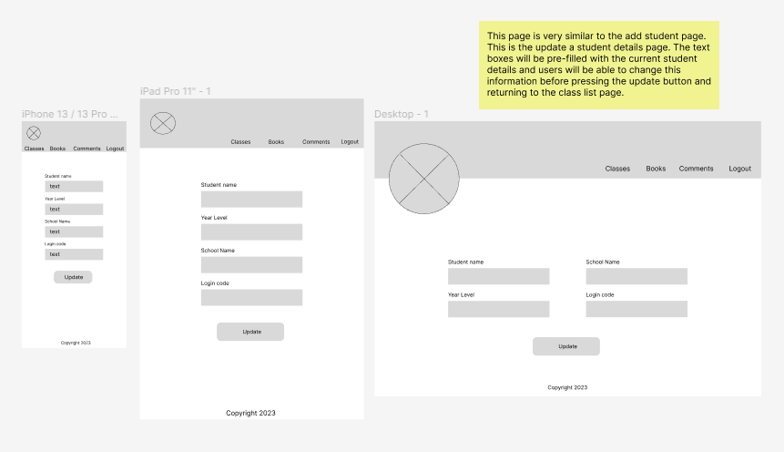

# HomeReader Documentation

## Nicole Hulett T3A1-Part A

[Production website](https://home-reader.com/)

[GitHub Repository Documentation](https://github.com/HomeReaderApp/HomeReaderDocs)

[GitHub Repository Front-End](https://github.com/HomeReaderApp/HomeReaderDocs)

[GitHub Repository Back-End](https://github.com/HomeReaderApp/HomeReaderDocs)

[Deployed Back-End](https://homereader-backend-dad51d74393a.herokuapp.com/)

[Deployed Front-End - Netlify](https://scintillating-eclair-9aa967.netlify.app/)

[Video presentation of Part A Application](https://vimeo.com/843611257/a16c99ae75)

[Video presentation of Part B Application]()

## Contents

[Purpose](#purpose)
[Functionality/Features](#functionality-features)
[Target Audience](#target-audience)
[Purpose](#purpose)
[Tech Stack](#tech-stack)
[Libraries and Packages](#libraries-and-packages-used)
[Application Architecture Diagram](#application-architecture-diagram)
[Dataflow Diagram](#dataflow-diagram)
[User Stories](#user-stories)
[Wireframes](#wireframes)
[Project Management](#project-management-web-build)
[Trello Board](#trello-board)
[Testing](#testing)

# Description 

# Purpose
The main purpose of the HomeReader application is to provide a tool to support teachers and parents in communicating a child’s home reading progress. Many schools today continue to use a hard copy book to log all the home reading a student does. This is not environmentally friendly, or supportive of parents that are already time poor. HomeReader aims to replace the need for the old style home reading log and provide more accurate and accessible information to teachers by students or parents (depending on age of child) logging their home reading each night on the app. 

# Functionality/Features
-	Separate login pages for teachers and students/parents
-	An easy to fill in form for students/parents to log their home reading
-	A teacher portal where a teacher can quickly navigate to the information they want to view
-	Ability for teachers to create more than one class and add students to each class
-	Teachers can provide an easy, but unique login code for each of their students
-	A page for teachers to see the highest rated books that their students have been reading
-	A page for teachers to see a list of the students in a class with easy functionality to update or delete students
-	An individual profile page that gives all the latest reading information on a specified student
-	A page where teachers can view any comments that parents/students are making

# Target Audience
The HomeReader application is targeted at teachers, parents and students. Teachers are the main audience, as they will be the users that control how the application is used by their students. Registered teachers also have access to the most information through the teacher portal. Parents will utilize the application to log their child’s home reading or assist this process depending on the age and ability of their child. The application is also targeted at students to log their home reading every day. HomeReader provides an easy to login and use interface to ensure the process can be done quickly and easily by students. 

# Tech Stack
**Front-end**
- HTML
- JavaScript
- CSS
- React

**Back-end**
- Express
- Node.js

**Database**
- MongoDB
- Mongoose

**Deployment**
- Netlify (Front-end)
- Heroku (Back-end)

**Project Management Tools**
- Trello

**Testing**
- Jest
- React testing library

**DevOps Tools**
- Git
- GitHub
- Visual Studio Code

**Design Tools**
- Figma
- Draw.io

# Libraries and Packages used

- **React** is a Javascript Library for creating front-end components. It is used to create user interfaces and is often used together with react-dom as a renderer.
- **React-router-dom** is used to implement dynamic routing in this application. It is used to build a single page application that can have many pages or components and this package helps to display the pages or navigate to them. Browser router assists in this process. 
- **React-use** is another react package used that is a collection of reusable React hooks. These hooks cover a wide range of functionality with a React app. 
- **React-testing-library** provides a simpler and user friendly way to test react components. It provides a set of functions and methods that help to write the tests and can simulate user interactions. 
- **Jest** is a JavaScript testing framework and is often used in conjuction with other tools like the React-testing library. Jest can also provide code coverage for your application. 
- **Jsonwebtokens** is a JavaScript library that is able to assist in generating and verifying JSON web tokens in Node.js and browser environments. It includes a number of different functions for authentication and authorisation purposes.
- **jwt-decode** is an npm package that allows developers to decode JSON web tokens without any validation or verification. It is mainly used on the client side to retrieve encoded information from payloads.
- **Bcrypt** is a password hashing algorithm that is used to secure sensitive passwords. This application also used salts in the hashing process to ensure no 2 hashes are ever the same.
- **CORS** is a Cross-Origin Resource Sharing package that allows web applications running in one domain to access resources located in a different domain. CORS is a set of HTTP headers that servers can use to indicate which origins are allowed to use their resources. In this project, the server was allowed to be used by the front-end react app. 
- **Dotenv** is an npm package that simplifies the process of loading environment variables from a '.env' file into a Node.js application.
- **Helmet** is another npm package that enhances the security of Express JS applications. When this package is installed it automatically applies a set of default security headers to the HTTP responses sent by the application. It helps protect against common web vulnerabilities. 
- **Express.js** is a web application framework for Node.js that is designed to build web applications and APIs more efficiently. It allows developers to handle various HTTP requests and responses, define routes and implement middleware functions. 
- **Mongoose** is a ODM (Object-Document Mapping) library for MongoDB and Node.js. It allows for easier interactions with a MongoDB database. It allows for schema definition of models, CRUD operations, validation and middleware, query building and data population. 
- **Supertest** is a library in Node.js that provides a straightforward way to test HTTP endpoints and APIs. It simulates HTTP requests without actually making network calls. In this project it was integrated with the Jest testing framework. 
- **mongod-memory-server** is a Node.js library that provides an in-memory MongoDB server for running unit tests for local development. 
- **npm** (Node Package Manager) is a package manager for the JavaScript programming language. It allows for the easy install and management of code packages and libraries. 

# Application Architecture Diagram

# Dataflow Diagram

Click [here](docs/dataDiagrams/DataflowDiagram.drawio.pdf) for a closer inspection of the below diagram.

# User Stories

### Teacher User

The first user of this application is a ‘Teacher’ in a primary school setting. However, this app could also potentially be used in secondary schools or special education settings as well. The ‘Teacher’ user is a user that is responsible for a class of students that encourage home reading every day. 

-	As a teacher, I want to be able to register and login securely to ensure I protect the school home reading data of students.
-	As a teacher, I want to be able to create my own class and give it an identifiable name.
-	As a teacher, I want to be able to add students to my class with a first and last name and a school year level.
-	As a teacher, I want to be able to give all my students a unique login code that they can use to login to a page to record their home reading.
-	As a teacher, I want to be able to view a list of the students in my class.
-	As a teacher, I want to be able to delete a student from the class list if a student leaves the class or the school.
-	As a teacher, I want to be able to view a list of books each of my students has read.
-	As a teacher, I want to find out how many nights each of my students has read.
-	As a teacher, I want to view a list of books that have a high rating from the students.
-	As a teacher, I want to view a list of any comments the students have submitted from their reading.

### Parent/Student user

The second user of this planned HomeReader App is a parent or student. These users are considered here as the same type of as user as what they want to be able to achieve is exactly the same. In a Primary school, students in lower grades do not yet have the ability to effectively use technology and record the appropriate information, therefore parents would need to be the user in this case and input the information. However, older primary school students are quite capable of recording their own home reading without the assistance of a parent. Therefore, they would still be using the app the exact same way as any parent user and for the same purpose.

-	As a parent/student, I want to be able to login easily to the HomeReader form page.
-	As a parent/student, I want to be able to input the title of the book read by the student, a rating of the book and a comment about the student’s reading.
-	As a parent/student, I want to be able to submit the form and get confirmation that it has been sent to the teacher.

### Modifications to user stories:

#### Teacher 

After discussion with a variety of teachers, young and old, the following user stories were created. Most teachers indicated that they would be logging in and accessing the application from a computer or tablet. 

-	As a teacher, I want to be able to access the information quickly.
-	As a teacher, I want the page to be easy to navigate.
-	As a teacher, I want to be able to reset my password if I forget it.
-	As a teacher, I want to be able to edit/update my students details or login codes.

#### Parent/Student

After discussion with parents and students at my current school, the following user stories need to be considered. Most of the below are to do with design and layout aspects of the application. Also, most students/parents indicated that they would access app on a mobile or tablet device.

-	As a parent/student, I want a simple and easy to remember login code.
-	As a parent/student, I want the page to record reading details to be uncluttered and easy to read.
-	As a parent/student, I want a calm screen view as students often read just before bed and record their results then.
-	As a parent/student I want the application to be easily accessible and viewable on a mobile or tablet device as well as a computer screen. 

# Wireframes

The final project does not exactly match the wireframes due to time constraints at the end of the project. The main logo is not centered on page, but to the left side. Their was difficulty on getting it to sit half on/half off the header bar and dynamically moving on different screen sizes. 
The final project is just styled in 'desktop mode', so there may be glitches in usage on a mobile device. However, these have been limited where possible. 
The copyright footer was also not implemented, but will be in the near future. It was not essential for the functionality of the application. 
The colour scheme is brown and greens to indicate nature. In the future, a photo header will be implemented to create a more sophisticated feel for the site. 

## Landing Page

## Teacher Login

## Teacher Register

## Teacher Portal

## Student Login

## Student reading form

## Classes

## Class list

## Add Student

## Edit Student

## Student profile

## Favourite books

## Comments

# Project Management

The HomeReader application utilised Agile Methodology in managing the build. The project was broken up into parts and each part was later turned into a Sprint. The four main parts were; front-end, back-end, documentation and testing. The back-end was the first sprint after original documentation and preparations had been completed. The back-end was further broken down into small chunks for all the different tasks that needed to be done to get a functioning and deployed web API server. This sprint was given 10 days for completion. The next sprint was the front-end. Again this part was broken down into smaller tasks to get the job. The time-frame again for this sprint was 10 days. The third big sprint was the testing for both front-end and back-end. This was further broken down according to unit or manual tests and for production and deployment. This sprint only allowed 7 days. The final sprint was to get all the documentation in order for the functioning application and was a much shorter sprint cycle. 

This project management technique also incorperated the use of Kanban in the form of Trello Boards as a visualisation technique for tasks. Trello boards allow the project to be broken down into small tasks with due dates, responsible team members and task size stated. See the Trello board screenshots to see how each of the sprints was organised with the backend tasks all being prioritised first. 

- [Trello board screenshots folder](./docs/trello/Trello-project-build )

Git commits were used regularly throughout the lifecyle of this project. The project also utilised many branches, to ensure all the features could be worked on independent of the main branch and not cause issues. The branches are based on the different sprints and tasks implemented. All branches were pushed to Github and then a pull request created with a comment. This would have allowed for communication had their been more than one developer working on this project. 

User stories were used for the project before it got underway to ensure the application was meeting the needs of the client. This is another tool of agile methodology. 

This project was completed solo, so therefore other important aspects of agile methodology weren't implemented correctly. These are things like daily standups with team members and sprint retrospectives. These are both in regards to communication with other team memebers and ensuring that the build process is a cycle with everything getting constantly reviewed and modified if needed. 

If this project had been done with a partner, each individual would have been responsible for working on either the front-end or back-end according to their strengths. I am much more confident in the back-end and express and this is where I would have put my skills to use. In regards to testing, this would have been a joint adventure, with each testing their own and the other person's code to ensure full reliability and accuracy of the tests. 

# Trello Board

My Trello board can be viewed [here](https://trello.com/b/vsvw5sQt/home-reader-app).

After further research on Trello. I updated how I was using labels and custom fields. My labels indicate the amount of work required for each card in regards to how small or big it is. The custom fields tag state what part of the application that card is related to. **Most task cards also indicate who was to work on them, had I been working with a partner, these would have been shared accoring to abilities and dependent on task and size**

# Testing

Here is a the link to the manual testing completed.
[Manual testing](docs/testing/Testing.xlsx)

Unit tests can be accessed via the src code. 